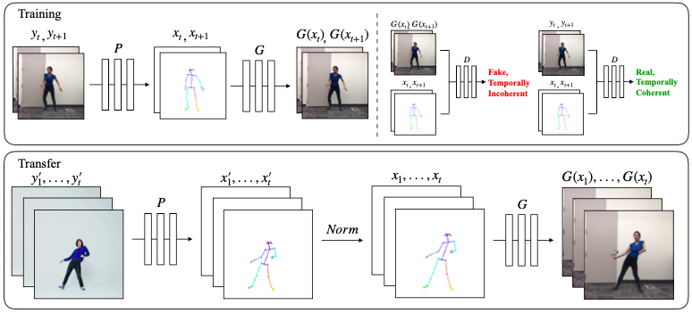
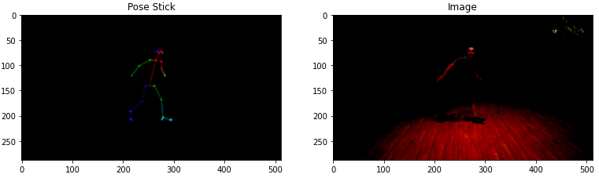
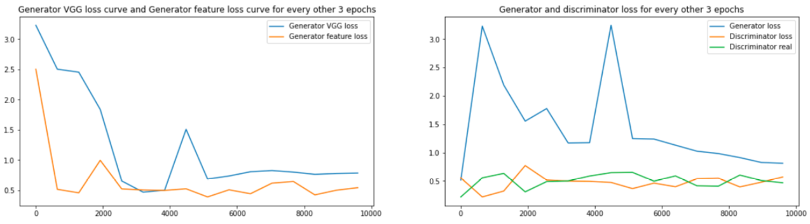
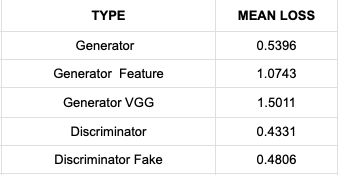
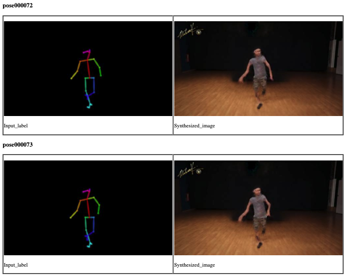
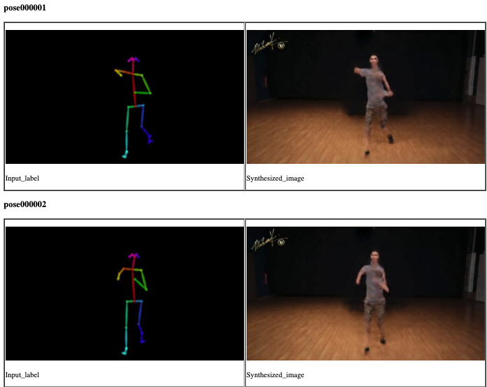

# Pose Detection and Transfer

## Introduction

We implement a method for **do-as-i-do** motion transfer. Here, we extract poses from the source subject and transfer them to a target subject by learning a video to video translation model. 
To obtain the body poses of subjects, we use pre-trained pose detector - [**OpenPose**](https://github.com/CMU-Perceptual-Computing-Lab/openpose). OpenPose detects human body, hand, facial, and foot keypoints on single images.

## Implementation

The following image shows the overview of pose detection and transfer:



#### Training
In the initial training process, we convert the subject to a pose stick-like figure using OpenPose (P). Then, we learn the mapping using Generator (G) and a Discriminator (D) to separate the real sequences from fake sequences. We have used a type of CGAN (**pix2pix**) developed by NVIDEA for transforming the image from one domain to another. 

#### Pose Transfer

Using openpose (P), we obtain the stick figures of the source person. Then, we try to normalize these figures to address the body shape and size differences. Finally, we apply the trained mapping (G) to obtain the final output. 
  

## Code and Notebooks

We executed all the ipynb notebooks in Google Colab as it supports free **GPU**.

### Prerequisites
```
cuda 10.0
dominate
Opencv
openpose
pytorch-gpu
tensorflow-gpu
```
### Running the Google Colab Notebooks

* `01_Make_Source_OpenPose.ipynb` - The source of the dataset is [Shuffle Step dance video](https://www.youtube.com/watch?v=1SKa4L8J21o). Build *OpenPose* and convert source video to pose stick video. Convert both the videos to image frames and save them. The pose stick frames are saved in `data/train_A` and the real image frames are saved in `data/train_B`. 
**Note**: If your train_A contains images with multiple classes please follow the instructions as given in pix2pixHD repository.

* `02_Make_target_OpenPose.ipynb` - The source of the target subject is [Choreography](https://www.youtube.com/watch?v=etG1e8iPxzU). Repeat the same steps again as of Step 1. Now, the pose stick frames are saved in `data_transfer/test_A` and the real image frames are saved in `data_transfer/test_B`.

* `03_Training.ipynb` - The initial training process and the parameters for the model can be set in `config/train_opt.py`. The entire duration for training the model depends on the number of images. In this case, the elapsed time was around **1 hr 17 min**. The results are saved in `checkpoints/Poses`. The html file in `checkpoints/Poses/web/index.html` can be used to visualize the poses in a better way. Try to open the html file in an editor for better visulaization.

* `04_Testing.ipynb` - We perform cross-validation here. It takes the images from `dataset_test/train_A`. We also see the results of losses in each epoch here.  The results of this notebook can be found in `checkpoints/Poses_test`. Similarly from the above step, preview the html file for better visualization.

* `05_Pose_Transfer.ipynb` - Here, we finally transfer the input pose labels to the target image. The results are saved in `results/Poses`. Similarly, use a text editor to preview the results. There is also a `results/Poses/images` folder where the input label and the corresponding synthesized output image can be viewed. 

* `06_Final_Output_Video.ipynb` - Since all the synthesized output poses are image frames, we convert these frames back to a video using VideoWriter. 

## Results

### OpenPose results － stick-like figures



### Training Loss

* The training is done stochasitcally  where the outcome involves some randomness and has some uncertainity. 


* Cross-validated the model and the following are the mean losses:



### Test Results  

* The following are the input lables and the corresponding synthesized output of the target subject





### Final Results
  

**We also included the link to view the videos and poses for the source subject, target subject, and the final output video. Click [Here](https://drive.google.com/open?id=1zMPdNXnCKrvAfdy0fJ-rkMLG-qt5FYiB).**


## References
- [Everybody Dance Now](https://arxiv.org/abs/1808.07371)
- [nyoki-pytorch](https://github.com/nyoki-mtl/pytorch-EverybodyDanceNow) pytorch-EverybodyDanceNow
- [pix2pixHD](https://github.com/NVIDIA/pix2pixHD)